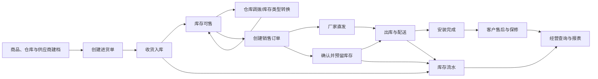
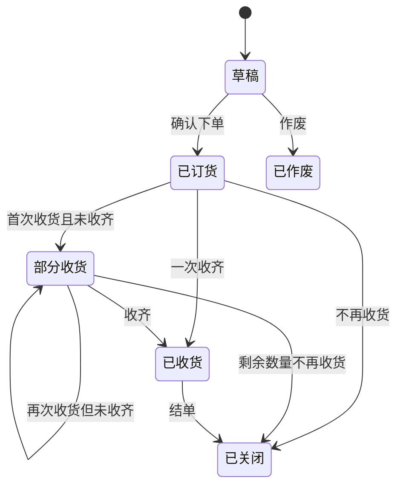
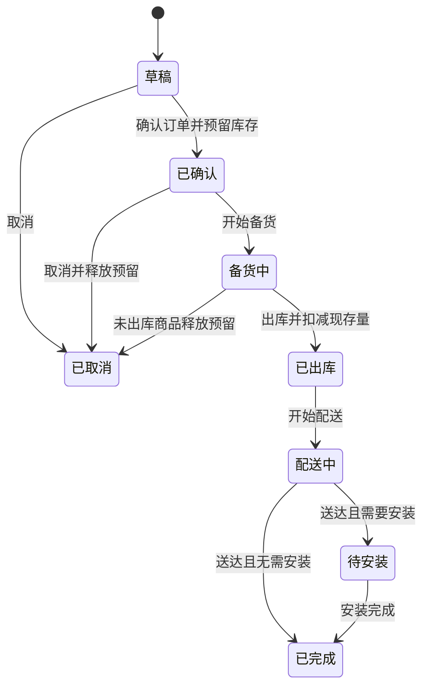
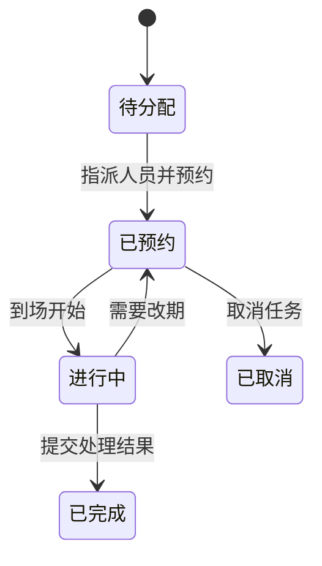
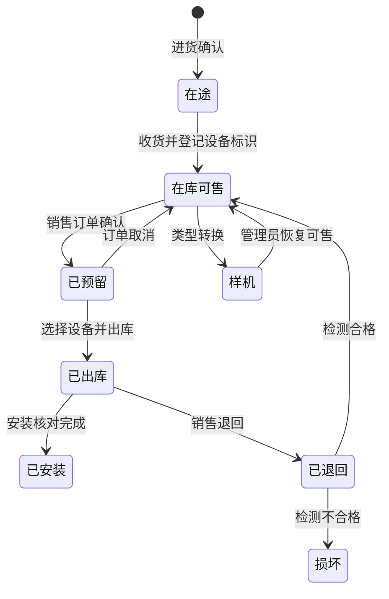

# 业务流程与页面设计

- 文档版本：`v0.2`
- 更新日期：`2026-08-02`

## 1. 设计目标

本文件定义第一版的业务闭环、状态变化和页面信息结构。界面设计遵循“手机快速录入、电脑高效查询”的原则，同一套数据和权限在不同屏幕下使用不同布局。

## 2. 总体业务闭环

## 3. 状态模型

### 3.1 进货单状态

规则：

- 草稿不影响在途和现存库存。
- 已订货和部分收货的未收数量计入在途量。
- 每次收货只增加实际收货数量，并创建独立入库流水。
- 每次收货指定目标仓库和库存类型；启用逐台追踪的商品必须登记设备标识。
- 已发生收货的单据不能直接作废；如需撤销，必须创建退货/反向库存流水。

### 3.2 销售订单状态

规则：

- 订单确认时增加预留量，不立即减少现存量。
- 出库时同时减少现存量和预留量，生成销售出库流水。
- 本店库存履约必须指定仓库和具体设备序列号；厂家直发不创建本店库存预留或出库流水。
- 已出库后的撤销不走“取消”，必须走退货或反向出库流程。
- 允许订单在缺货时保持草稿，或由管理员标记“缺货待采”；普通用户不能制造负库存。
- 订单完成不代表已收款，收款状态独立维护。

### 3.3 收款状态

- 未收款：累计收款为 0。
- 部分收款：累计收款大于 0 且小于应收金额。
- 已收款：累计有效收款等于应收金额。
- 已退款：存在退款且当前应收已结清或订单已退。
- 异常：累计收款超过应收金额时阻止保存并提示处理差额。

第一版记录收款流水但不与微信或支付宝接口连接。每笔流水记录金额、方式、时间、经办人和备注；订单另存约定还款日期、欠款余额和催收备注。每次有效收款或退款后重新计算欠款余额，不能手工覆盖汇总金额。

### 3.4 安装任务状态

完成安装时，应记录实际完成时间、负责人和处理说明，并核对或补录该设备的序列号、机身码和保修卡号。不同商品的必填标识和是否需要现场图片在商品配置中确定。

### 3.5 售后工单状态

- 待处理：已受理但未开始。
- 处理中：负责人正在处理。
- 等待配件：因配件或厂家处理暂停。
- 已解决：问题已经处理，等待确认或归档。
- 已关闭：工单正式结束。

售后工单可以关联原销售订单和商品，也允许为缺少历史订单的老客户手工创建。

## 4. 多仓库与库存变化规则

### 4.1 库存指标

- 现存量：某个仓库和库存类型中实际拥有的数量。
- 预留量：已确认但尚未出库订单在指定仓库占用的数量。
- 可用量：现存量减预留量。
- 在途量：已订货但尚未实际收货的数量。
- 总库存：各实体仓库现存量之和；厂家直发商品不计入总库存。

### 4.2 仓库与库存类型

- 仓库/库位由管理员维护，例如门店仓、后仓、临时仓，实际名称待样例确认。
- 库存类型包括正常可售、样机、赠品、退回待检和损坏品。
- 商品在仓库之间移动使用调拨单，调出与调入生成关联流水，总库存不变。
- 商品在同一仓库改变用途时使用库存类型转换，例如样机转正常可售，必须填写原因。
- 厂家直发作为销售订单的履约来源记录，不建立虚拟现存库存；需要跟踪供应商发货、送达和设备标识。

### 4.3 流水类型

- 采购入库：增加现存量。
- 销售出库：减少现存量，同时释放对应预留。
- 销售退货：增加现存量，需检查商品状态是否可再次销售。
- 采购退货：减少现存量。
- 盘盈：增加现存量，必须填写原因。
- 盘亏/损坏：减少现存量，必须填写原因。
- 调拨出/调拨入：仓库间成对产生，使用同一调拨单关联。
- 库存类型转换：原类型减少、目标类型增加，使用同一转换单关联。
- 冲销：对错误流水做等量反向处理，不覆盖原流水。

### 4.4 序列号设备生命周期

- 序列号、机身码等设备标识按配置校验唯一。
- 一个设备任一时点只能属于一个仓库、库存类型或出库/安装状态。
- 厂家直发设备可从“厂家已发货”进入“已出库/待安装”，但必须在安装完成前登记设备标识。
- 售后记录优先关联具体设备，确保保修和维修历史可追溯。

### 4.5 并发保护

两个用户同时确认订单时，系统必须在数据库事务中重新检查指定仓库的可用库存和设备状态。只有先成功确认的订单获得库存，后一个订单收到明确的库存不足或设备已占用提示，避免超卖和序列号重复占用。

## 5. 页面信息架构

### 5.1 主导航

- 首页
- 销售订单
- 进货管理
- 商品库存
- 仓库调拨
- 客户
- 安装售后
- 应收欠款
- 报表
- 系统管理（按权限显示）

### 5.2 页面清单

#### 首页

- 今日与本月订单摘要。
- 待确认、待配送、待安装、未收款/逾期欠款、待售后数量。
- 按仓库汇总的低库存商品列表。
- 最近订单和快捷开单入口。

#### 销售订单列表

- 搜索：订单号、客户姓名、手机号、商品型号。
- 筛选：日期、订单状态、收款状态、安装状态、销售人。
- 快捷操作：新建、查看、继续处理、导出。
- 手机端以紧凑列表显示；电脑端使用数据表格。

#### 销售订单新建/编辑

1. 选择或新增客户。
2. 选择安装/配送地址。
3. 搜索并添加商品，选择本店仓库出库或厂家直发，显示对应仓库可用库存。
4. 填写数量、成交单价、优惠和附加费用。
5. 选择配送与安装安排。
6. 需要追踪时选择具体设备序列号，保存草稿或确认订单。

手机端使用分段表单和底部固定金额/提交栏，避免一次展示过多字段。

#### 进货单列表与详情

- 按供应商、日期、状态、单号搜索。
- 新建进货、确认订货、分批收货、关闭剩余数量。
- 详情展示订货数、已收数、未收数、实际成本和收货记录。

#### 商品与库存

- 商品卡片/表格切换。
- 型号、分类、品牌、状态、低库存筛选。
- 详情按仓库和库存类型展示库存四指标、设备清单和库存流水。
- 支持按序列号、机身码、仓库和库存类型搜索。
- 管理员可发起盘点调整、类型转换和仓库调拨，用户只读。

#### 仓库调拨

- 管理员选择调出仓、调入仓、商品、数量和具体设备。
- 调拨确认前校验可用库存和设备状态。
- 调拨详情展示成对的调出/调入流水和经办人。

#### 客户列表与详情

- 通过姓名、手机号、地址关键字搜索。
- 详情顶部展示联系方式和地址。
- 下方按时间线展示订单、安装和售后记录。
- 对可能重复客户提供提示，不自动合并。

#### 安装售后

- 用户账号提供“我的任务”和“全部任务”视图。
- 按日期、负责人和状态筛选。
- 手机端突出拨打电话、导航地址、更新状态和添加备注。
- 电话与地图动作调用设备能力，不把客户数据发送给未授权第三方。

#### 应收欠款

- 按客户、订单、约定还款日期、逾期状态和负责人筛选。
- 展示订单应收、累计收款、退款、当前欠款和最近跟进记录。
- 可从订单或欠款列表新增收款和催收备注，汇总金额由系统计算。

#### 报表

- 销售概览、商品销售、库存现状、库存流水、应收情况。
- 支持日期范围、仓库、库存类型、商品和经办人等维度筛选。
- 数据表与简单图表并存，导出遵守权限。

#### 系统管理

- 用户与角色。
- 品牌、分类、单位、收款方式等字典。
- 店铺与单号设置。
- 仓库/库位、库存类型和打印模板设置。
- 审计日志。
- 备份状态和恢复说明。

## 6. 响应式交互要求

### 6.1 手机端

- 主要点击目标适合手指操作，常用动作固定在容易触达的位置。
- 列表默认展示最重要的 3 至 5 个字段，其他内容进入详情。
- 宽表格转换为卡片、分组行或可展开详情，不强迫横向滚动。
- 新建订单支持草稿自动保存，返回时提示未提交内容。
- 拍照上传前压缩，显示上传进度和失败重试。
- 销售单和安装单提供打印/PDF入口，手机端可以先预览再调用系统打印。

### 6.2 电脑端

- 充分利用宽屏展示筛选区、数据表格和批量导出。
- 列表保持固定操作列，金额与数量右对齐。
- 详情页可并排显示基本信息和处理时间线，但不使用多层嵌套卡片。
- 打印页面使用独立版式，不直接打印后台列表或详情页面。

### 6.3 PWA

- 支持添加到手机桌面和独立窗口启动。
- 缓存应用外壳和静态资源，提高二次打开速度。
- 第一版不承诺断网新增订单；离线时只显示网络提示，禁止提交可能重复的业务动作。

## 7. 错误与空状态

- 库存不足：显示缺少的商品、当前可用量和可采取动作。
- 重复提交：按钮进入提交中状态，服务端使用幂等或状态检查拒绝重复业务动作。
- 序列号冲突：指出已被占用的设备标识和当前状态，不允许继续出库。
- 权限不足：说明当前操作不可用，不泄露敏感数据是否存在。
- 无查询结果：保留筛选条件并提供清除筛选入口。
- 网络失败：保留未提交表单，允许用户重试。
- 业务冲突：例如订单已被他人处理，提示刷新后查看最新状态。

## 8. 页面原型前的业务确认

进入高保真页面设计前，使用真实样例验证以下内容：

1. 用 10 笔销售订单覆盖直接提货、送货安装、厂家直发、多次收款、欠款、取消和售后场景。
2. 用 5 笔进货记录覆盖多个仓库、一次收齐、分批到货、序列号收货和短缺关闭。
3. 让管理员、日常业务用户和安装售后用户各走一遍自己的操作路径，删除没人使用的字段。
