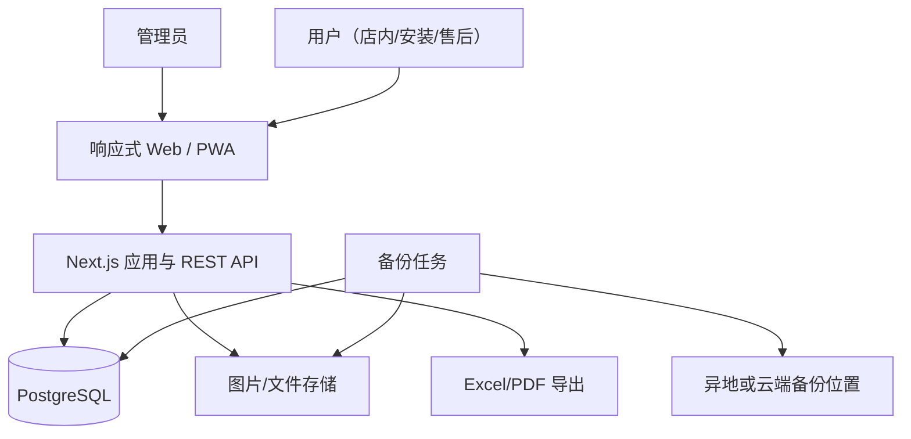
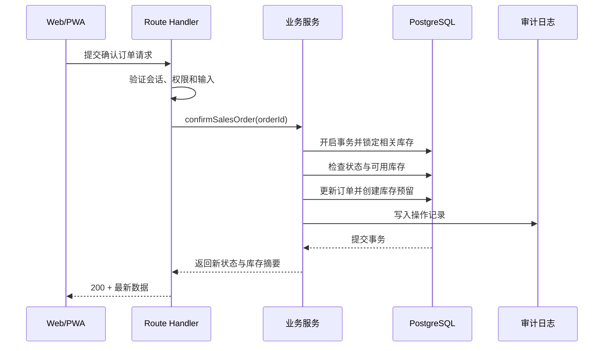

# 技术架构设计

- 文档版本：`v0.2`
- 更新日期：`2026-08-02`

## 1. 架构目标

第一版采用单体应用和单一数据库，优先降低开发、部署、排查与备份成本。系统规模或团队边界真正扩大后，再根据数据决定是否拆分服务，避免提前承担微服务的协调成本。

目标包括：

- 一套代码同时适配电脑和手机浏览器。
- 前后端共享 TypeScript 类型和校验规则。
- 业务动作具备事务、权限和审计保障。
- 可通过 Docker 在云服务器或店内 NAS 部署。
- 第一版原生支持多仓库、特殊库存、逐台序列号、多次收款、欠款和单据打印。
- 结构清楚，允许后续增加条码扫描、更多打印模板和外部通知。

## 2. 推荐技术栈

### 2.1 应用层

- Web 框架：Next.js（App Router）+ TypeScript。
- UI：Tailwind CSS、shadcn/ui、Lucide 图标和自定义响应式业务组件。
- 表单与校验：React Hook Form + Zod。
- 数据请求：服务端渲染结合 TanStack Query，用于交互性较强的列表与状态更新。
- PWA：Web App Manifest + Service Worker，仅缓存应用外壳和静态资源。
- 图表：Recharts，用于少量经营图表。

### 2.2 服务与数据层

- API：Next.js Route Handlers，采用版本化 REST 接口。
- ORM：Prisma。
- 数据库：PostgreSQL。
- 认证：数据库会话 + `HttpOnly`、`Secure`、`SameSite` Cookie。
- 密码：Argon2id 哈希。
- 文件：第一版使用受控文件存储；云部署时建议兼容 S3 的对象存储。
- Excel：服务端生成受权限约束的 `.xlsx` 文件。
- 数据导入：流式解析 Excel/CSV，先校验预览再分批写入；1 万条以内无需引入独立大数据平台。
- 打印/PDF：独立打印视图配合 CSS print 样式；需要固定文件时由服务端生成 PDF。

### 2.3 部署与运维

- 容器：Docker Compose。
- 入口：Caddy 或 Nginx，负责 HTTPS、压缩和反向代理。
- 进程：应用容器 + PostgreSQL + 可选对象存储。
- 备份：数据库定时逻辑备份，文件存储单独备份，备份复制到另一物理位置。
- 监控：健康检查、结构化日志、磁盘和备份失败提醒。

## 3. 系统上下文



## 4. 应用模块

建议按业务模块组织代码，不按纯技术层堆放所有文件：

```text
src/
  app/                 # 页面和 API 路由
  modules/
    auth/
    users/
    products/
    suppliers/
    purchases/
    warehouses/
    customers/
    sales/
    inventory/
    service/
    reports/
    imports/
    printing/
    audit/
  components/          # 跨模块通用组件
  lib/                 # 数据库、会话、日志、错误等基础设施
  styles/
prisma/
  schema.prisma
  migrations/
tests/
  unit/
  integration/
  e2e/
```

每个业务模块包含自己的 schema、服务、查询、权限和测试。跨模块写操作通过明确的应用服务完成，例如“确认销售订单”同时负责订单状态、指定仓库库存预留、序列号设备占用和审计日志。

## 5. 请求与写入流程



业务规则必须在服务端执行。前端的禁用按钮和提示只改善体验，不能作为库存、权限或金额校验的唯一保障。

## 6. 认证与权限

### 6.1 认证

- 登录成功后创建服务端会话，浏览器只保存不可被 JavaScript 读取的会话 Cookie。
- 会话保存用户、过期时间和必要的设备信息；密码或哈希不进入会话。
- 修改密码、停用账号或收回关键权限时，使相关会话失效。
- 登录接口限流并记录失败事件，但日志不保存用户输入的密码。

### 6.2 授权

采用 RBAC，第一版只预置管理员和用户两种角色。安装与售后人员属于用户角色，通过任务负责人而非第三种角色区分工作。用户可以查看客户完整地址；成本、利润、账号、审计、系统设置、库存调整和冲销仅管理员可操作。

权限资源建议包括：

- `product.read/write/cost.read`
- `purchase.read/write/receive`
- `sales.read/write/confirm/outbound/price.override`
- `inventory.read/adjust`
- `warehouse.read/manage/transfer`
- `customer.read/write/export`
- `service.read/write/assign`
- `report.sales/report.margin/report.inventory`
- `receivable.read/write`
- `print.sales/print.installation/import.manage`
- `user.manage/audit.read/system.manage`

接口和服务层均校验权限；页面隐藏不是授权手段。报表与导出复用同一权限规则。

## 7. 数据一致性设计

### 7.1 事务边界

以下动作必须在单个数据库事务中完成：

- 确认订单：状态检查 + 库存检查 + 创建预留 + 审计。
- 销售出库：订单状态更新 + 指定仓库现存量减少 + 预留释放 + 序列号状态更新 + 流水。
- 取消订单：状态更新 + 预留释放 + 审计。
- 采购收货：收货明细 + 目标仓库现存量增加 + 序列号设备登记 + 入库流水 + 进货单状态。
- 库存调整：权限检查 + 库存更新 + 调整流水 + 审计。
- 仓库调拨：调出减少 + 调入增加 + 序列号仓库更新 + 成对流水。
- 库存类型转换：原类型减少 + 目标类型增加 + 序列号类型更新 + 成对流水。
- 多次收款：收款流水 + 已收汇总 + 欠款余额和状态更新。
- 退货/冲销：原业务校验 + 反向流水 + 关联状态更新。

### 7.2 并发控制

- 写库存时在事务内锁定对应商品、仓库和库存类型的余额记录，或使用带版本号的乐观并发控制。
- 占用或出库序列号设备时同时校验其仓库、库存类型和当前状态，数据库唯一约束作为最后防线。
- 所有状态转换带“当前状态”条件，避免两个用户重复执行。
- 前端提交关键动作时附带幂等键或操作令牌，服务端保存短期执行结果。

### 7.3 金额与时间

- 金额使用数据库整数，单位为分。
- 数量使用支持小数的定点类型；若业务确认所有商品只按台/张计数，可限制为整数。
- 数据库保存标准时间戳，展示和业务日期按 `Asia/Shanghai` 处理。

## 8. API 约定

- 路径前缀：`/api/v1`。
- 请求与响应：JSON；文件上传使用 `multipart/form-data`。
- 列表统一支持分页、排序和白名单筛选。
- 业务错误返回稳定错误码、用户可读消息和追踪 ID。
- 不向客户端返回数据库异常、堆栈或未授权对象详情。
- 更新操作优先使用表达业务意图的动作接口，例如 `/sales-orders/{id}/confirm`，不允许客户端任意写状态字段。
- 厂家直发接口明确区分本店库存履约，不通过虚拟入库再出库的方式伪造库存流水。

错误示例：

```json
{
  "error": {
    "code": "INVENTORY_INSUFFICIENT",
    "message": "商品 WH-001 可用库存不足",
    "requestId": "req_xxx",
    "details": {
      "productId": "...",
      "available": 1,
      "requested": 2
    }
  }
}
```

## 9. 文件与图片

- 允许的文件类型、大小和数量由服务端校验，不信任扩展名。
- 图片上传后生成随机存储键，不直接使用用户文件名作为路径。
- 商品图、安装图和售后图按业务对象关联，记录上传人和时间。
- 私有图片通过鉴权接口或短时签名地址访问。
- 删除业务对象时不立即物理删除关联文件，先进入延迟清理队列。

### 9.1 打印与 PDF

- 销售单和安装单使用独立打印数据模型，避免页面改版影响历史单据样式。
- 默认提供标准 A4 模板；取得现有纸质样张后配置店铺抬头、字段、签字区和纸张尺寸。
- 打印内容在服务端按当前用户权限生成，成本和利润不进入面向客户或安装人员的单据。
- PDF 文件按订单当前版本生成，必要时记录打印人、打印时间和模板版本。

### 9.2 数据导入

- 导入过程分为上传、字段映射、校验预览、确认写入和结果报告五步。
- 1 万条以内数据采用分批事务，单批失败不会留下半条业务记录。
- 商品、客户和历史订单分别导入，历史数据缺少字段时使用明确的“未知/未迁移”状态，不伪造库存或收款流水。
- 导入文件只允许管理员访问，并设置自动清理周期。

## 10. 日志、审计与可观测性

- 应用日志使用结构化 JSON，包含时间、级别、请求 ID、用户 ID 和错误码。
- 审计日志与应用错误日志分开，审计日志记录业务变更而非调试信息。
- 对登录异常、库存调整、订单冲销、权限变更、备份失败设置重点告警。
- 健康检查区分应用存活和数据库可用，避免仅进程存在却无法服务。

## 11. 备份与恢复

- 数据库每日自动备份，备份文件加密或置于受控存储。
- 图片/附件与数据库备份使用一致的保留周期。
- 至少保留一份不在应用服务器同一磁盘上的副本。
- 恢复演练在独立环境进行，验证用户、订单、库存流水和附件能够对应。
- 上线前形成书面恢复步骤，记录最近一次成功备份和恢复演练时间。

具体保留天数、恢复点目标和可接受停机时间，需要结合订单量、服务器方案和店主承受能力确定。

## 12. 部署选择

### 12.1 云服务器（默认建议）

优点是店内和外出安装现场都能访问，公网证书和异地备份更容易。代价是持续服务器费用、网络依赖和更严格的安全维护。

### 12.2 店内 NAS/电脑

优点是数据主要留在本地、没有持续云主机费用。代价是外出访问、断电、宽带公网入口、证书和异地备份更复杂。

第一版建议先使用云服务器或可靠的托管环境。若店内网络经常中断、明确要求数据不出本地，或已有稳定 NAS 与运维能力，再改为本地部署。

## 13. 暂不采用的技术

- 微服务：当前模块和用户规模不足以抵消部署、联调和数据一致性成本。
- 原生 App：浏览器/PWA 已覆盖内部移动录入，原生开发会增加双端维护。
- 复杂消息队列：第一版核心动作同步完成；耗时导出和图片处理需要时再引入任务队列。
- 离线订单同步：多仓库、序列号和欠款会放大冲突风险，第一版只缓存静态资源。
- 第三方低代码作为核心数据层：早期快，但复杂库存事务、审计和后续迁移可能形成较高转换成本。

## 14. 架构重审条件

出现以下情况时重新评估架构，不按预想规模提前拆分：

- 增加多个门店，需要门店级数据隔离、跨门店调拨与独立核算。
- 大量安装人员并发使用，任务调度成为独立业务。
- 需要与厂家、财务、支付、短信或微信系统稳定集成。
- 报表计算明显影响日常开单。
- 文件量和访问量使本地文件存储成为瓶颈。
