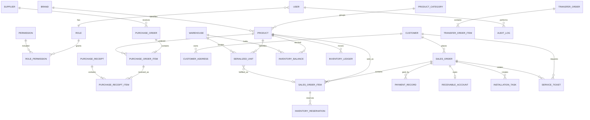

# 数据模型与接口设计

- 文档版本：`v0.2`
- 更新日期：`2026-08-02`

## 1. 设计原则

- 使用稳定的内部 ID 关联数据，单号和商品型号作为业务可读标识。
- 历史业务记录不因商品、客户或账号停用而丢失。
- 订单状态变化通过业务动作完成，不开放任意状态覆盖。
- 库存流水不可修改；错误通过冲销流水修正。
- 金额以人民币分保存，数量使用定点数或经业务确认后限制为整数。
- 关键表包含创建人、更新时间和必要的版本字段。

## 2. 实体关系



## 3. 核心表设计

以下字段是逻辑设计，最终名称和类型以 Prisma schema 与数据库迁移为准。所有 ID 建议使用 UUID 或有序分布式 ID。

### 3.1 用户与权限

#### `users`

- `id`：主键。
- `username`：登录名，唯一。
- `display_name`：显示姓名。
- `phone`：内部联系电话，可空。
- `password_hash`：Argon2id 哈希。
- `role_id`：所属角色。
- `status`：`ACTIVE`、`DISABLED`。
- `password_changed_at`、`last_login_at`。
- `created_at`、`updated_at`。

#### `roles`

- `id`、`code`、`name`、`description`。
- `is_system`：系统角色不允许普通删除。

第一版只建立 `ADMIN`（管理员）和 `USER`（用户）两个系统角色。安装与售后人员使用 `USER` 角色，通过任务分配记录责任人。

#### `permissions`

- `id`、`code`、`name`、`description`。

#### `role_permissions`

- `role_id`、`permission_id`，联合唯一。

#### `sessions`

- `id`、`user_id`、`token_hash`、`expires_at`。
- `ip_address`、`user_agent`、`revoked_at`、`created_at`。

### 3.2 商品主数据

#### `brands`

- `id`、`name`、`code`、`status`、`sort_order`。

初始品牌可以包含“万和”“喜乐乐”，但必须作为数据配置，不写死在程序中。

#### `product_categories`

- `id`、`parent_id`、`name`、`code`、`status`、`sort_order`。

可配置热水器、取暖桌及其子分类。

#### `products`

- `id`：主键。
- `sku`：内部商品编码，唯一。
- `model`：厂家型号，在启用商品中唯一或按品牌联合唯一，待业务确认。
- `name`：商品名称。
- `brand_id`、`category_id`。
- `specification`：规格说明。
- `capacity`、`color`、`energy_grade`：可空的业务属性。
- `unit`：默认“台”或“张”，来源于字典。
- `purchase_price_cent`：参考进价，敏感字段。
- `retail_price_cent`：建议零售价。
- `warranty_months`：默认保修月数。
- `low_stock_threshold`：库存预警值。
- `serial_tracking_enabled`：是否逐台跟踪序列号。
- `serial_number_required`、`machine_code_required`、`warranty_card_required`：设备标识必填配置。
- `status`：`ACTIVE`、`INACTIVE`。
- `created_by`、`created_at`、`updated_at`。

#### `product_images`

- `id`、`product_id`、`storage_key`、`sort_order`。
- `mime_type`、`size_bytes`、`uploaded_by`、`created_at`。

### 3.3 供应商与进货

#### `suppliers`

- `id`、`name`、`contact_name`、`phone`、`address`、`notes`。
- `status`、`created_at`、`updated_at`。

#### `purchase_orders`

- `id`、`order_no`（唯一）。
- `supplier_id`、`order_date`、`expected_date`。
- `status`：`DRAFT`、`ORDERED`、`PARTIALLY_RECEIVED`、`RECEIVED`、`CLOSED`、`VOIDED`。
- `goods_amount_cent`、`shipping_fee_cent`、`discount_cent`、`total_amount_cent`。
- `notes`、`created_by`、`confirmed_by`、`confirmed_at`。
- `version`、`created_at`、`updated_at`。

#### `purchase_order_items`

- `id`、`purchase_order_id`、`product_id`。
- `ordered_quantity`、`received_quantity`。
- `unit_cost_cent`、`line_amount_cent`。
- `notes`。

同一进货单允许同一商品出现一次；如果需要不同批次价格，拆成明细行并增加行号。

#### `purchase_receipts`

- `id`、`receipt_no`（唯一）、`purchase_order_id`。
- `warehouse_id`：本次收货进入的仓库。
- `received_at`、`received_by`、`notes`、`created_at`。

#### `purchase_receipt_items`

- `id`、`purchase_receipt_id`、`purchase_order_item_id`。
- `product_id`、`quantity`、`stock_type`、`unit_cost_cent`。
- 启用序列号时，明细数量必须与本次创建的设备台账数量一致。

### 3.4 客户与地址

#### `customers`

- `id`、`name`、`primary_phone`、`wechat`。
- `tags`：第一版可使用受控字符串数组，后续需要统计时拆分标签表。
- `notes`、`status`、`created_by`、`created_at`、`updated_at`。

手机号不设置全局唯一约束，因为家庭成员可能共用号码；创建时做重复提示。

#### `customer_addresses`

- `id`、`customer_id`、`contact_name`、`contact_phone`。
- `province`、`city`、`district`、`detail_address`。
- `is_default`、`created_at`、`updated_at`。

销售订单保存地址快照，客户修改常用地址不能改变历史订单。

### 3.5 销售、收款与配送

#### `sales_orders`

- `id`、`order_no`（唯一）。
- `customer_id`、`salesperson_id`、`order_date`。
- `status`：销售主状态。
- `payment_status`：`UNPAID`、`PARTIALLY_PAID`、`PAID`、`REFUNDED`。
- `delivery_status`：`NOT_REQUIRED`、`PENDING`、`DELIVERING`、`DELIVERED`、`CANCELLED`。
- `installation_status`：`NOT_REQUIRED`、`PENDING`、`SCHEDULED`、`IN_PROGRESS`、`COMPLETED`、`CANCELLED`。
- `goods_amount_cent`、`discount_cent`、`delivery_fee_cent`、`installation_fee_cent`、`total_amount_cent`。
- `paid_amount_cent`：有效收款减退款的汇总快照。
- `receivable_amount_cent`：当前欠款汇总快照。
- `promised_payment_date`：最近一次约定还款日期，可空。
- `delivery_method`、`planned_delivery_at`。
- `contact_name`、`contact_phone`、`delivery_address_snapshot`。
- `notes`、`created_by`、`confirmed_by`、`confirmed_at`。
- `version`、`created_at`、`updated_at`。

#### `sales_order_items`

- `id`、`sales_order_id`、`product_id`。
- `product_name_snapshot`、`sku_snapshot`、`model_snapshot`。
- `quantity`、`unit_price_cent`、`discount_cent`、`line_amount_cent`。
- `fulfillment_source`：`WAREHOUSE` 或 `SUPPLIER_DIRECT`。
- `source_warehouse_id`：本店出库仓库，厂家直发时为空。
- `direct_supplier_id`：厂家直发供应商，本店出库时为空。
- `unit_cost_snapshot_cent`：确认或出库时写入，用于历史毛利估算。
- `requires_installation`、`warranty_months_snapshot`、`notes`。

商品名称、型号、价格和保修使用快照，商品主数据后续修改不影响历史订单。

#### `payment_records`

- `id`、`sales_order_id`、`record_no`（唯一）。
- `type`：`PAYMENT`、`REFUND`。
- `amount_cent`、`method`、`occurred_at`。
- `handled_by`、`notes`、`voided_at`、`voided_by`、`created_at`。

错误收款记录通过作废并创建更正记录处理，不直接修改金额。

#### `receivable_accounts`

- `id`、`sales_order_id`（唯一）、`customer_id`。
- `original_amount_cent`、`outstanding_amount_cent`。
- `promised_payment_date`、`status`：`OPEN`、`PARTIALLY_PAID`、`SETTLED`、`OVERDUE`。
- `last_followed_at`、`created_at`、`updated_at`。

#### `receivable_followups`

- `id`、`receivable_account_id`、`contacted_at`、`result`、`next_followup_at`。
- `created_by`、`created_at`。

欠款余额由订单应收、有效收款和退款计算，不允许直接手工填写；约定还款日期和催收备注可以更新并保留历史。

#### `delivery_records`

- `id`、`sales_order_id`、`status`。
- `planned_at`、`completed_at`、`handled_by`、`notes`。
- 第一版可与订单一对多，支持改期和记录过程。

### 3.6 安装与售后

#### `installation_tasks`

- `id`、`task_no`（唯一）、`sales_order_id`。
- `assignee_id`、`status`。
- `contact_name`、`contact_phone`、`address_snapshot`。
- `scheduled_at`、`started_at`、`completed_at`。
- `result_notes`、`created_by`、`created_at`、`updated_at`。

#### `installation_task_units`

- `installation_task_id`、`serialized_unit_id`，联合唯一。
- `verified_serial_number`、`verified_machine_code`、`verified_warranty_card_number`。
- `verified_by`、`verified_at`。

#### `service_tickets`

- `id`、`ticket_no`（唯一）。
- `customer_id`、`sales_order_id`、`sales_order_item_id`、`serialized_unit_id`，后面三项可空。
- `subject`、`description`、`status`、`priority`。
- `assignee_id`、`accepted_at`、`resolved_at`、`closed_at`。
- `resolution`、`warranty_status`、`created_by`、`created_at`、`updated_at`。

#### `attachments`

- `id`、`owner_type`、`owner_id`。
- `storage_key`、`original_name`、`mime_type`、`size_bytes`。
- `uploaded_by`、`created_at`、`deleted_at`。

若后续需要强外键约束，可以把不同业务附件拆成关联表，而不是长期使用多态关联。

### 3.7 库存

#### `warehouses`

- `id`、`code`（唯一）、`name`、`address`。
- `type`：`STORE`、`BACKROOM`、`TEMPORARY` 等实体或逻辑库位类型。
- `status`：`ACTIVE`、`INACTIVE`。
- `created_at`、`updated_at`。

厂家直发不创建仓库现存量，因此不需要用“厂家虚拟仓”伪造入库和出库。仓库停用前必须清空现存量和预留量。

#### `inventory_balances`

- `id`、`product_id`、`warehouse_id`、`stock_type`。
- `stock_type`：`SALEABLE`、`SAMPLE`、`GIFT`、`RETURN_PENDING`、`DAMAGED`。
- `on_hand_quantity`、`reserved_quantity`。
- `version`、`updated_at`。
- `product_id + warehouse_id + stock_type` 联合唯一。

只有 `SALEABLE` 默认可以被普通销售订单预留。样机转可售、赠品领用和退回品复售必须通过明确业务动作转换类型并留痕。

#### `inventory_reservations`

- `id`、`sales_order_item_id`、`product_id`、`warehouse_id`、`stock_type`。
- `quantity`、`status`：`ACTIVE`、`RELEASED`、`CONSUMED`。
- `created_at`、`released_at`、`consumed_at`。

#### `inventory_ledgers`

- `id`、`product_id`、`warehouse_id`。
- `stock_type`、`counterparty_warehouse_id`：调拨或类型转换时记录另一侧。
- `movement_type`：采购入库、销售出库、退货、盘盈、盘亏、冲销等。
- `quantity_delta`：带正负号的变化量。
- `quantity_after`：该流水完成后的现存量快照。
- `source_type`、`source_id`、`source_line_id`。
- `reason_code`、`notes`、`occurred_at`、`created_by`、`created_at`。
- `reversal_of_id`：冲销原流水，可空。

流水写入后禁止更新和删除。来源单据与动作组合应具备唯一约束，防止重复入库或重复出库。

#### `serialized_units`

- `id`、`product_id`。
- `serial_number`、`machine_code`、`warranty_card_number`：按商品配置必填并分别建立唯一索引。
- `warehouse_id`、`stock_type`：设备仍在店内时的当前位置和类型。
- `status`：`IN_TRANSIT`、`AVAILABLE`、`RESERVED`、`OUTBOUND`、`INSTALLED`、`RETURNED`、`DAMAGED`。
- `purchase_receipt_item_id`、`sales_order_item_id`、`installation_task_id`：来源与去向。
- `reserved_at`、`outbound_at`、`installed_at`。
- `created_at`、`updated_at`、`version`。

设备出库后 `warehouse_id` 为空，但历史位置通过设备事件与库存流水查询。厂家直发设备可以不关联采购收货明细，但必须关联直发销售明细和供应商。

#### `serialized_unit_events`

- `id`、`serialized_unit_id`、`event_type`。
- `from_warehouse_id`、`to_warehouse_id`、`from_status`、`to_status`。
- `source_type`、`source_id`、`occurred_at`、`created_by`、`notes`。

设备事件不可修改，用于查询单机从收货、调拨、销售、安装到售后的完整时间线。

#### `transfer_orders`

- `id`、`transfer_no`（唯一）。
- `from_warehouse_id`、`to_warehouse_id`，两者不得相同。
- `status`：`DRAFT`、`CONFIRMED`、`COMPLETED`、`VOIDED`。
- `notes`、`created_by`、`confirmed_by`、`confirmed_at`、`created_at`。

#### `transfer_order_items`

- `id`、`transfer_order_id`、`product_id`、`stock_type`、`quantity`。
- 启用序列号的商品通过关联表选择具体 `serialized_unit_id`，数量必须一致。

第一版仓库调拨在单个事务内同时完成调出和调入，不设计长时间“运输中”的跨门店调拨。后续出现异地仓库时再扩展发出、在途、收货状态。

#### `inventory_adjustments`

- `id`、`adjustment_no`、`product_id`、`warehouse_id`。
- `quantity_before`、`quantity_delta`、`quantity_after`。
- `reason_code`、`notes`、`created_by`、`approved_by`、`created_at`。

第一版只有管理员可以调整库存，不额外设置二次审批；每次调整必须填写原因并进入审计日志。

### 3.8 审计与配置

#### `audit_logs`

- `id`、`actor_user_id`、`action`。
- `entity_type`、`entity_id`。
- `before_summary`、`after_summary`：仅保存允许审计的字段摘要。
- `ip_address`、`user_agent`、`request_id`、`created_at`。

审计摘要需要过滤密码哈希、会话令牌等秘密字段。

#### `system_settings`

- `key`、`value_json`、`description`、`updated_by`、`updated_at`。
- 只允许白名单配置键，不作为任意键值数据库使用。

#### `number_sequences`

- `business_type`、`date_key`、`current_value`、`updated_at`。
- 在事务中生成采购单、销售单、收货单、安装单和售后单号。

## 4. 编码与字典建议

- 销售单：`XS-YYYYMMDD-流水号`。
- 进货单：`JH-YYYYMMDD-流水号`。
- 收货单：`SH-YYYYMMDD-流水号`。
- 安装单：`AZ-YYYYMMDD-流水号`。
- 售后单：`SHOUHOU-YYYYMMDD-流水号` 或更短的店内约定。

流水号长度根据日订单峰值确认。单号只用于展示和搜索，内部关联始终使用主键 ID。

受控字典包括单位、收款方式、配送方式、库存调整原因、售后问题类型和客户标签。会参与程序分支的核心状态使用代码枚举，不允许管理员随意改名导致逻辑失效。

## 5. 索引与约束

建议的关键索引：

- `products(sku)` 唯一；`products(brand_id, model)` 根据确认结果设置唯一。
- `sales_orders(order_no)`、`purchase_orders(order_no)` 唯一。
- `sales_orders(customer_id, order_date desc)`。
- `sales_orders(status, order_date desc)`。
- `customers(primary_phone)` 普通索引，用于重复提示和搜索。
- `inventory_ledgers(product_id, warehouse_id, occurred_at desc)`。
- `inventory_balances(product_id, warehouse_id, stock_type)` 联合唯一。
- `serialized_units(serial_number)`、`serialized_units(machine_code)` 在非空值上分别唯一。
- `serialized_units(product_id, warehouse_id, status)`。
- `transfer_orders(transfer_no)` 唯一。
- `receivable_accounts(status, promised_payment_date)`。
- `service_tickets(assignee_id, status, created_at)`。
- `installation_tasks(assignee_id, status, scheduled_at)`。
- `audit_logs(entity_type, entity_id, created_at desc)`。

数据库检查约束：

- 金额和数量在业务允许范围内，优惠不能使订单总额为负。
- `reserved_quantity >= 0`，默认 `on_hand_quantity >= 0`。
- 序列号设备的仓库、库存类型和状态组合必须合法，已出库或已安装设备不能仍标记为在库。
- 调拨单的调出仓和调入仓不得相同，调拨前后商品总库存不变。
- 厂家直发销售明细必须有供应商且不能填写本店出库仓库。
- 收货数量大于 0，累计收货不超过订货数量。
- 收款与退款金额大于 0。
- 完成时间不得早于创建时间；跨日预约按实际情况允许调整。

## 6. REST API 清单

以下为第一版接口边界，不代表每个接口都允许所有角色调用。

### 6.1 认证与用户

- `POST /api/v1/auth/login`
- `POST /api/v1/auth/logout`
- `GET /api/v1/auth/me`
- `POST /api/v1/auth/change-password`
- `GET/POST /api/v1/users`
- `GET/PATCH /api/v1/users/{id}`
- `POST /api/v1/users/{id}/disable`
- `POST /api/v1/users/{id}/reset-password`
- `GET /api/v1/roles`

### 6.2 商品与库存

- `GET/POST /api/v1/products`
- `GET/PATCH /api/v1/products/{id}`
- `POST /api/v1/products/{id}/activate`
- `POST /api/v1/products/{id}/deactivate`
- `POST /api/v1/products/{id}/images`
- `GET/POST /api/v1/warehouses`
- `GET/PATCH /api/v1/warehouses/{id}`
- `GET /api/v1/inventory`
- `GET /api/v1/inventory/{productId}`
- `GET /api/v1/inventory/{productId}/ledger`
- `GET /api/v1/serialized-units`
- `GET /api/v1/serialized-units/{id}`
- `GET /api/v1/serialized-units/{id}/timeline`
- `POST /api/v1/inventory/adjustments`
- `GET/POST /api/v1/transfer-orders`
- `POST /api/v1/transfer-orders/{id}/confirm`
- `POST /api/v1/inventory/type-conversions`
- `GET /api/v1/inventory/low-stock`

### 6.3 进货

- `GET/POST /api/v1/suppliers`
- `GET/PATCH /api/v1/suppliers/{id}`
- `GET/POST /api/v1/purchase-orders`
- `GET/PATCH /api/v1/purchase-orders/{id}`
- `POST /api/v1/purchase-orders/{id}/confirm`
- `POST /api/v1/purchase-orders/{id}/receive`
- `POST /api/v1/purchase-orders/{id}/close`
- `POST /api/v1/purchase-orders/{id}/void`

### 6.4 客户与销售

- `GET/POST /api/v1/customers`
- `GET/PATCH /api/v1/customers/{id}`
- `GET /api/v1/customers/{id}/timeline`
- `GET/POST /api/v1/sales-orders`
- `GET/PATCH /api/v1/sales-orders/{id}`
- `POST /api/v1/sales-orders/{id}/confirm`
- `POST /api/v1/sales-orders/{id}/start-picking`
- `POST /api/v1/sales-orders/{id}/outbound`
- `POST /api/v1/sales-orders/{id}/cancel`
- `POST /api/v1/sales-orders/{id}/payments`
- `POST /api/v1/payment-records/{id}/void`
- `GET/PATCH /api/v1/sales-orders/{id}/receivable`
- `POST /api/v1/receivables/{id}/followups`
- `POST /api/v1/sales-orders/{id}/direct-ship`

### 6.5 安装与售后

- `GET/POST /api/v1/installation-tasks`
- `GET/PATCH /api/v1/installation-tasks/{id}`
- `POST /api/v1/installation-tasks/{id}/assign`
- `POST /api/v1/installation-tasks/{id}/schedule`
- `POST /api/v1/installation-tasks/{id}/start`
- `POST /api/v1/installation-tasks/{id}/complete`
- `GET/POST /api/v1/service-tickets`
- `GET/PATCH /api/v1/service-tickets/{id}`
- `POST /api/v1/service-tickets/{id}/transition`
- `POST /api/v1/attachments`

### 6.6 首页、报表与审计

- `GET /api/v1/dashboard`
- `GET /api/v1/reports/sales`
- `GET /api/v1/reports/inventory`
- `GET /api/v1/reports/receivables`
- `POST /api/v1/exports`
- `GET /api/v1/exports/{id}`
- `POST /api/v1/imports`
- `GET /api/v1/imports/{id}/preview`
- `POST /api/v1/imports/{id}/commit`
- `GET /api/v1/sales-orders/{id}/print`
- `GET /api/v1/installation-tasks/{id}/print`
- `GET /api/v1/audit-logs`
- `GET/PATCH /api/v1/settings`

## 7. 列表与分页约定

请求示例：

```text
GET /api/v1/sales-orders?page=1&pageSize=20&status=CONFIRMED&keyword=13800000000&sort=-orderDate
```

响应示例：

```json
{
  "data": [],
  "pagination": {
    "page": 1,
    "pageSize": 20,
    "total": 0,
    "totalPages": 0
  }
}
```

- `pageSize` 设服务端上限，防止一次导出绕过正常导出流程。
- 排序字段使用白名单，不能把客户端输入直接拼入 SQL。
- 导出使用与列表相同的筛选结构和权限校验。

## 8. 状态动作约定

状态转换接口返回最新实体、受影响库存摘要和可用的后续动作。若状态已变化，返回 `409 CONFLICT` 和稳定业务错误码。

示例：

```json
{
  "data": {
    "order": {
      "id": "...",
      "status": "CONFIRMED",
      "version": 3
    },
    "inventory": [
      {
        "productId": "...",
        "onHand": 5,
        "reserved": 2,
        "available": 3
      }
    ],
    "allowedActions": ["START_PICKING", "CANCEL"]
  }
}
```

## 9. 数据迁移原则

- 先把现有表格复制到只读备份，再进行清洗和导入。
- 商品按品牌、型号和规格匹配；无法自动确定的记录进入人工确认清单。
- 客户按手机号提示重复，但不自动合并姓名或地址不同的记录。
- 历史订单可以先按“已完成”导入，不强行伪造缺失的库存流水。
- 迁移报告记录读取数、成功数、跳过数、失败原因和人工处理结果。
- 正式切换前至少进行一次全量试导入并由店主抽查。
- 已确认迁移规模在 1 万条以内，按商品、客户、历史订单分文件或分工作表处理，并保留每行处理结果。

## 10. 已确认与待定的数据决策

已确认：多仓库、特殊库存、逐台设备标识、多次收款、欠款明细、打印和 1 万条以内数据迁移均纳入第一版。

仍需确认：

1. 商品型号是全局唯一，还是只在同一品牌内唯一。
2. 数量是否永远是整数，赠送小配件是否也纳入库存。
3. 不同商品需要序列号、机身码和保修卡号中的哪些字段，收货时能否全部取得。
4. 商品成本采用最新进价、移动平均还是逐批成本；第一版报表默认使用订单明细成本快照。
5. 退货商品在检测后如何区分可再次销售、需维修和报废。
6. 实际仓库/库位名称和用户是否需要按仓库限制操作。
7. 收款方式、收款凭证、逾期规则和提醒时间。
8. 现有销售单、安装单的纸张尺寸和版式样张。
